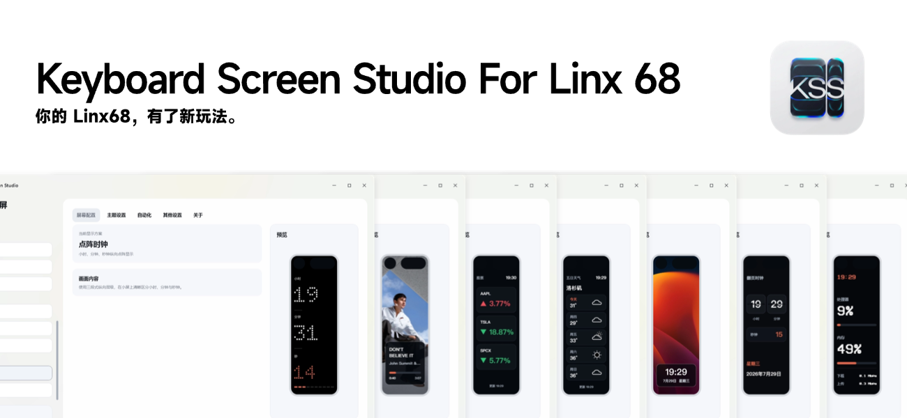

<p align="center"></p>

# Keyboard Screen Studio

*Читати [українською](README.uk.md) · [简体中文](README.zh-Hans.md)*

Keyboard Screen Studio (KSS) is a desktop tool for the Linx68 keyboard's portrait
display. It renders system status, clocks, weather, market quotes, media
information and picture themes onto the 142×428 screen and pushes them to the
keyboard automatically through its image API.

The interface and the rendered themes are available in **English, Ukrainian and
Simplified Chinese**; the language is switchable at runtime under *Other settings*.

## Status

- **Windows:** v1.10.1, on Avalonia UI. This is the released platform.
- **macOS:** the cross-platform project and packaging scripts are kept in the
  tree. Intel and Apple Silicon builds still need testing on real hardware and
  are not published as a stable release.
- **Linux:** not released. The data, rendering and platform layers leave room
  for it.

## Features

- 33 built-in themes across monitoring, time, information, music, dot matrix
  and picture-clock categories — including a screen builder that stacks
  widgets of your choice into a custom layout, a detailed hardware monitor with
  rotating pages, currency rates, Binance crypto with sparklines, a pomodoro
  timer, a GitHub contribution grid, disk fill bars, a ping monitor, world
  clocks, event countdowns, an ICS calendar feed, and Ukrainian air-raid
  alerts fed by alerts.in.ua (informational only — never your sole warning
  source) with an optional alert-priority takeover: full screen or a popup
  banner, until the all-clear or for a set time.
- A night schedule that can switch the theme and dim the screen between
  configurable hours, a theme carousel that rotates a chosen set of screens,
  Telegram message popups from your own account drawn over any theme, and
  opt-in Windows notifications (Claude limits, keyboard offline, price
  alerts) with anti-spam cooldowns.
- Theme switching from the keyboard itself: the Linx68 volume knob turns to
  the next/previous theme and its press pauses the carousel — bindable to the
  keyboard alone by VID:PID, with an optional volume-key mute, or driven by
  a key combination you record yourself, so volume is never touched — useful
  whether or not the board can be remapped in VIA/QMK. Off by default.
- A per-theme refresh interval and per-theme accent colour, a 12/24-hour
  clock and °C/°F units, sunrise/sunset and air quality on the weather
  screen, a stock portfolio row fed by per-symbol quantities, extra
  keyboards that mirror every frame, and settings export/import that strips
  secrets from the backup file.
- Live 142×428 preview that keeps the keyboard firmware's status-bar safe area.
- Custom accent colour, screen font, content safe area and picture-clock layout.
- Light, dark and follow-the-system application themes, independent of what the
  keyboard renders.
- Scheduled refresh and push, automatic media theme switching, tray residency
  and launch at startup.
- A first-run guide that asks only for the keyboard's IP address.
- AI usage (in development) reads from a Tokscale installation you set up
  yourself; KSS never stores platform credentials.
- A Claude usage theme showing the rolling 5-hour window, the week across every
  model and one model's week as three horizontal meters, with the time until
  each resets. These are your account's own figures: the screen borrows the
  login Claude Code already holds on the PC, so there is nothing to paste and
  nothing to sign in to. See [PRIVACY.md](PRIVACY.md).

## Requirements

- Windows 10 19041 or newer.
- The computer and the keyboard on the same local network.
- "Image API" enabled in the keyboard menu, with the address it shows entered
  into KSS.

Download `KeyboardScreenStudio-v1.10.1-win-x64.zip` from Releases, unpack it and
run `KeyboardScreenStudio.exe`. The release is self-contained — no separate .NET
installation is required.

## Building from source

```powershell
dotnet restore KeyboardScreenStudio.sln
dotnet build src/KeyboardScreen.App.Avalonia/KeyboardScreen.App.Avalonia.csproj -c Release
dotnet run --project tests/KeyboardScreen.SmokeTests/KeyboardScreen.SmokeTests.csproj -c Release
```

Create the portable Windows package:

```powershell
./tools/Publish-Portable.ps1
```

> Install the .NET 9 SDK locally for the full set of Avalonia compile-time
> diagnostics. The .NET 8 SDK also builds the solution, with one analyzer
> version warning.

## Translations

User-facing strings live in three embedded catalogues under
`src/KeyboardScreen.Core/Localization/`:

| File | Language |
| --- | --- |
| `Strings.en.json` | English |
| `Strings.uk.json` | Ukrainian |
| `Strings.zh-Hans.json` | Simplified Chinese |

All three files carry the same keys. To add a language, add an entry to
`AppLanguageInfo.All`, add a matching `Strings.<id>.json`, and register it as an
`EmbeddedResource` in `KeyboardScreen.Core.csproj`. The smoke tests fail the
build if the catalogues drift apart, if a value is empty, or if a translation
does not take the same `{0}`…`{n}` placeholders as English.

Screen text is drawn onto a 142 px wide display, so keys prefixed `Screen*` must
stay short in every language — the renderer truncates with an ellipsis rather
than wrapping.

## Data and privacy

KSS keeps settings and sign-in state on the local machine only. Weather, quotes
and AI usage come from third-party sources and may be delayed, inaccurate or
change without notice; stock information is shown for display purposes and is
not investment advice. See [PRIVACY.md](PRIVACY.md) and
[THIRD-PARTY-NOTICES.md](THIRD-PARTY-NOTICES.md).

## Licence

The source code is under the [MIT License](LICENSE). The application and tray
icons are covered separately — see [ASSET_LICENSE.md](ASSET_LICENSE.md).
